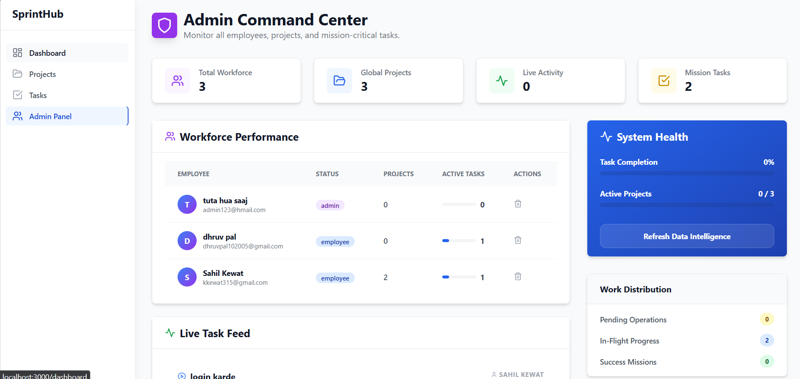
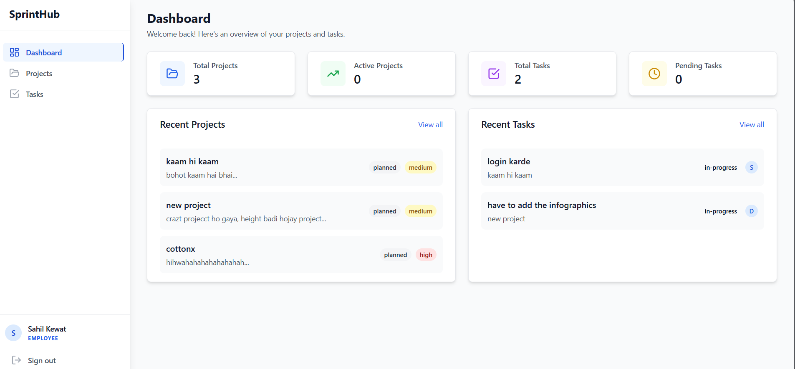

# 🚀 SprintHub

A high-performance, role-based project management system built for clarity, security, and speed. SprintHub enables administrators to oversee the entire workforce while providing employees with a focused environment for task execution and progress reporting.

---

## 📸 Visual Overview

### Admin Command Center
*Full oversight of workforce performance, global projects, and real-time task intelligence.*


### Employee Dashboard
*Personalized workspace for tracking assigned missions and submitting status updates.*


---

## ⚡ Core Features

- **🔐 Advanced RBAC**: Strict separation between Admin and Employee capabilities.
- **🛡️ Secure Auth**: JWT-based authentication with Bcrypt password hashing and lazy migration for legacy accounts.
- **📊 Real-time Analytics**: Live activity feeds and dynamic performance metrics.
- **💼 Task Lifecycle**: Comprehensive CRUD operations for projects and tasks with rich status tracking.
- **🚀 Scalable Design**: Stateless API architecture ready for horizontal scaling and microservices.

---

## 🛠️ Technical Architecture

### Backend
- **Engine**: Node.js & Express
- **Database**: Supabase (PostgreSQL)
- **Security**: Case-insensitive role authorization, Rate limiting, and Helmet.js protection.
- **Docs**: Integrated Swagger UI for API exploration.

### Frontend
- **Library**: React 18 (Vite)
- **Styling**: Tailwind CSS (Glassmorphism & Modern aesthetics)
- **Icons**: Lucide React
- **Navigation**: React Router 6

---

## 📖 API Reference

Access the interactive API documentation at:
`http://localhost:5000/api-docs`

| Method | Endpoint | Description | Access |
| :--- | :--- | :--- | :--- |
| `POST` | `/api/v1/auth/login` | Secure user authentication | Public |
| `POST` | `/api/v1/projects` | Initialize a new project | Admin |
| `GET` | `/api/v1/tasks` | Retrieve all tasks | Authenticated |
| `PATCH` | `/api/v1/tasks/:id/status` | Submit work progress | Employee/Admin |

---

## 📈 Scalability Roadmap

1. **Caching**: Redis integration for high-frequency dashboard statistics.
2. **Microservices**: Decoupling the Task Engine from the Project Manager.
3. **Load Balancing**: Support for Nginx/AWS ALB with stateless JWT sessions.
4. **Monitoring**: Integration with Prometheus/Grafana for system health tracking.

---

## 🚀 Installation & Setup

### Repository
```bash
git clone https://github.com/Sahilkewat80085/SprintHub.git
```

### Environment Configuration
Create a `.env` file in the `backend` directory:
```env
PORT=5000
SUPABASE_URL=your_supabase_url
SUPABASE_SERVICE_ROLE_KEY=your_service_role_key
JWT_SECRET=your_jwt_secret
```

### Development Launch
1. **Backend**:
   ```bash
   cd backend && npm install && npm run dev
   ```
2. **Frontend**:
   ```bash
   cd frontend && npm install && npm run dev
   ```

---

## 🛠️ Git Workflow

- **Status**: `git status`
- **Stage**: `git add .`
- **Commit**: `git commit -m "feat: description"`
- **Deploy**: `git push origin main`
